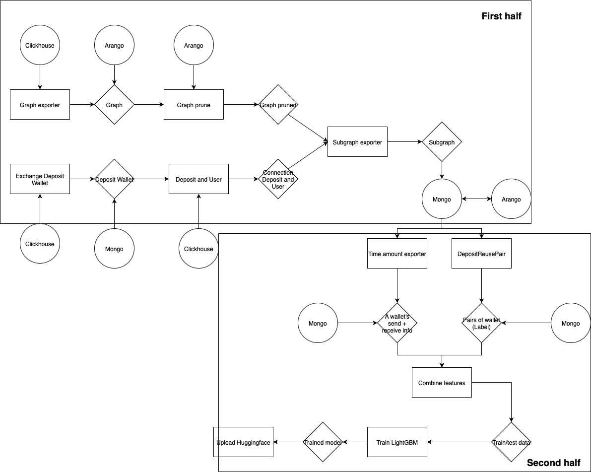
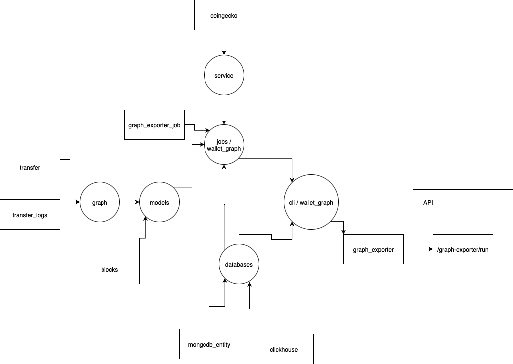
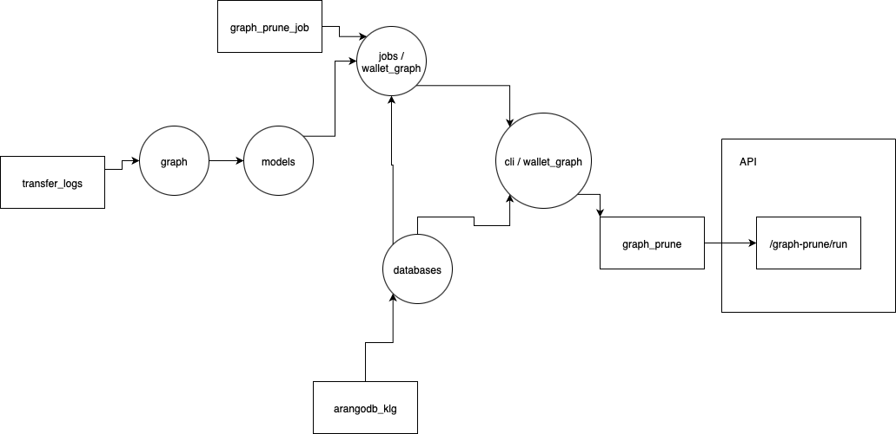
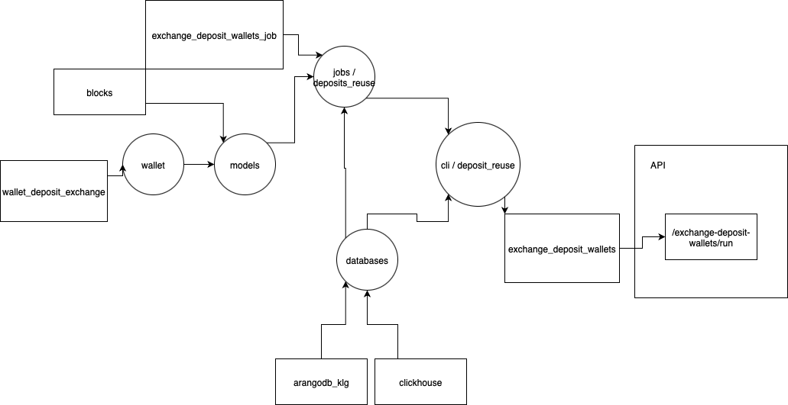
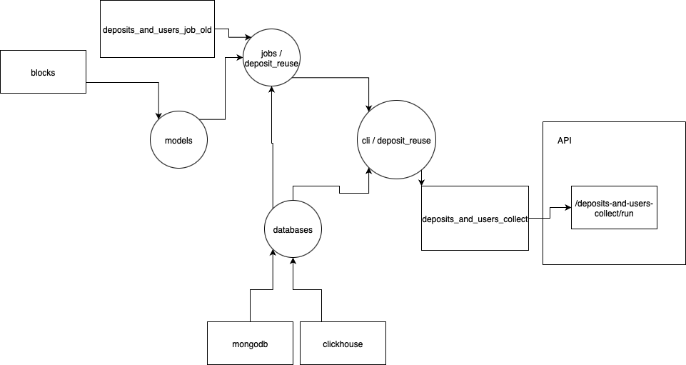
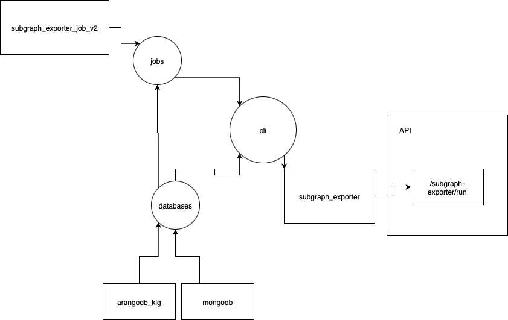
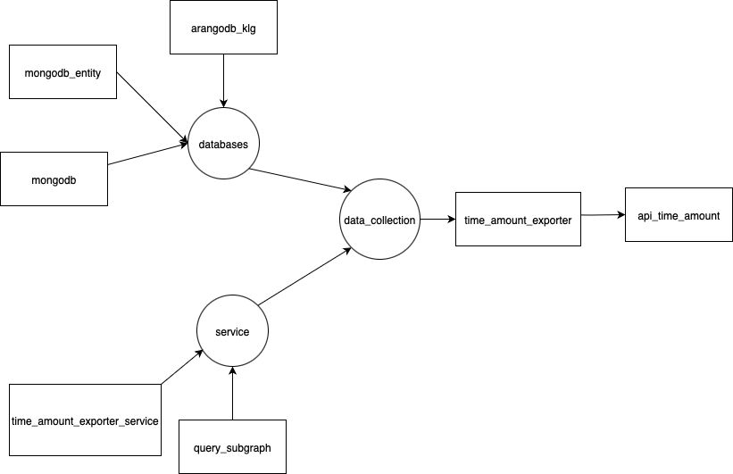
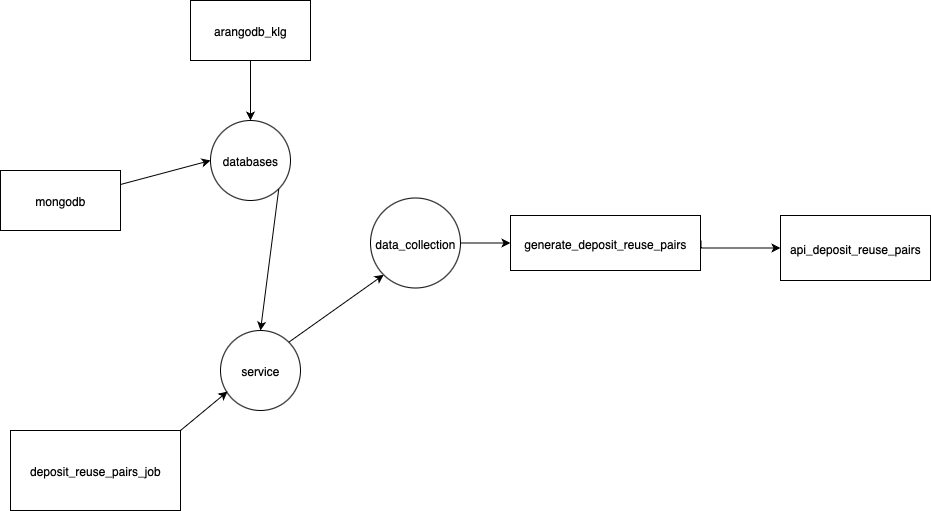
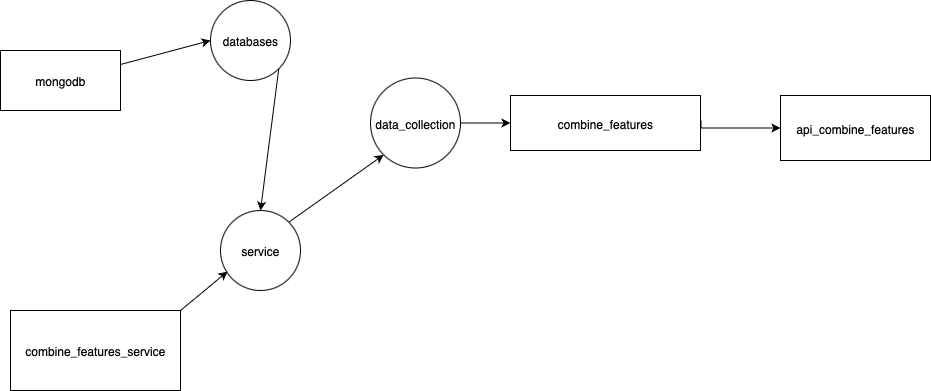

# Address Clustering – Pipeline Flows

This project implements the full data pipeline for address clustering and training.  
Each stage is represented as a flow diagram:

---

## 📊 General Pipeline

---

## 🔹 Data Collection Flows
Run from 1 - 5 accordingly
### 1. Graph Exporter
To load graph and entity from Clickhouse and Mongo DB: Run API "/graph/exporter/run". Output data is in Arango

### 2. Graph Prune
To prune graph above: Run API "/graph/prune/run" Output data is in Arango

### 3. Exchange Deposit Wallets
To export Exchange Deposit Wallets from Clickhouse: Run API "/graph/exchange-deposit-wallets/run". Output data is in Mongo

### 4. Deposits and Users Collect
To export Deposit Wallets and User Wallets pairs from ArangoDB and MongoDB: Run API "/graph/deposits-and-users/run". Output data is in Mongo

### 5. Subgraph Exporter
To export Subgraph from ArangoDB and MongoDB: Run API "/graph/subgraph-exporter/run". Output data is in Mongo

NOTE: 1 to 5 API is for debug and can instead run "/all/all-graph/run" for convenience. (/all/all-graph/run is the combination of 5 APIs)
---

## 🔹 Feature Engineering Flows

### 6. Time Amount Exporter
To export Deposit Wallets and User Wallets pairs from Clickhouse and MongoDB: Run API "/graph/deposits-and-users/run". Output data is in Mongo

### 7. Deposit Reuse Pairs
To export Deposit Reuse pairs from MongoDB: Run API "/data/deposit_reuse_pairs/run". Output data is in Mongo

### 8. Combine Features
To export training/test data from MongoDB: Run API "/data/combine-features/run". Output data is in Mongo

---

## 🔹 Training and upload
### 9. Training and upload
To train and test lightGBM and upload to huggingface from MongoDB: Run API "/train/from-mongo-to-txt-hf/run". Output model is on HuggingFace

NOTE: 6 to 9 API is for debug and can instead run "/all/data-collection-and-train/run" for convenience. (/all/data-collection-and-train/run is the combination of 4 APIs)

To run the system: Can either run 9 APIs or "/all/all-graph/run" + "/all/data-collection-and-train/run"
